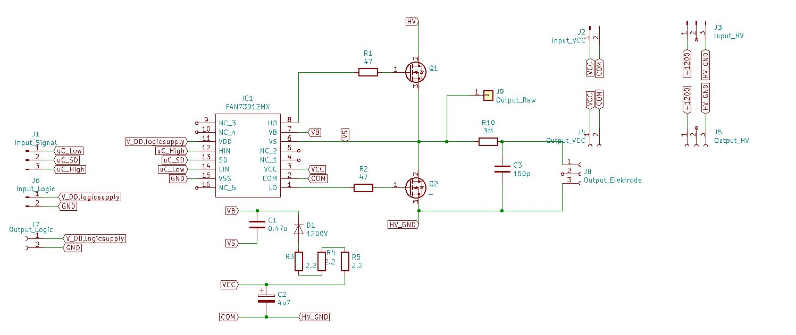
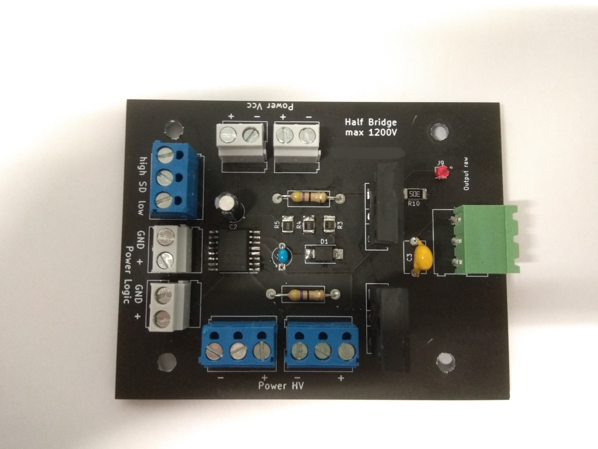
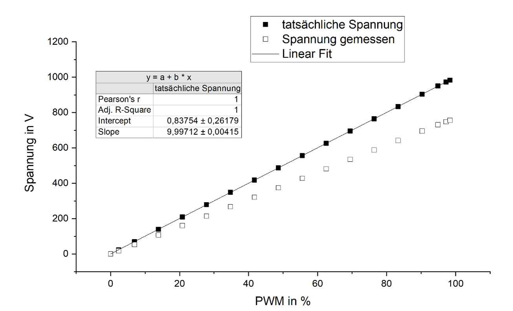

# adjustable_high_voltage_source
This project was developed as part of the [contactless electrostatic grippers](https://github.com/Fersaar/contactless_electrostatic_gripper) project. To control the individual gripper zones, it is essential to supply them with a variable voltage ranging from 0V to 1000V. The required current is minimal, as only the individual gripper electrodes need to be charged. In the final gripper design, this circuit will be positioned between the microcontroller and the gripper.

## Requirements

- Variable output voltage between 0V and 1000V
- External supply of 1000V DC
- Linear voltage regulation
- Input: PWM signal with 3.3V and variable duty cycle
- Cut-off frequency of 1kHz
- As cost-effective and straightforward as possible

## Design

The core of the design is a half-bridge circuit utilizing the "FAN73912mx" driver, which can withstand voltages up to 1200V. However, it is not isolated, so all ground potentials must be interconnected. The circuit design follows the reference layout provided by the driver, incorporating a bootstrap circuit to switch the MOSFETs. The output is filtered through an RC gate to eliminate the PWM signal and provide a stable DC voltage. The switching frequency is set at 20kHz. While the design may not be optimal, it effectively meets the application’s requirements.

## PCB

The completed circuit board is designed to allow multiple units to be stacked vertically, with supply lines that can be easily looped through.

| | |
|--|---|
| | |
| single half bridge|stacked half bridges |

The quiescent current at 1000V and 20kHz is approximately 3 mA. The minimum voltage resolution is determined by the PWM resolution; for instance, with a 12-bit signal, the resolution is about 0.244V.

The voltage can be controlled linearly as desired: 

### BOM

| Part | Quantity | Link |  |
|--------------------------------------------------------------------------|----------|-----------------------------------------------------------------------------------------------------------|---------------|
| fan73912mx | 1 | https://de.farnell.com/on-semiconductor/fan73912mx/gate-treiber-halbbr-cke-wsoic/dp/2748785?st=fan73912mx | IC1 |
| electrolytic capacitor, 4.7 µF, 50 V | 1 | https://de.farnell.com/rubycon/50yxf4r7mefc5x11/kondensator-4-7-f-50v-20/dp/2811491 | C2 |
| ceramic multilayer capacitor, 0.47 µF, 50 V | 1 | https://de.farnell.com/murata/rder71h474k1m1h03a/kondensator-0-47uf-50v-mlcc-radial/dp/2990810 | C1 C_Boot |
| 47 Ohm, +-5%, 350V | 2 | https://de.farnell.com/multicomp/mcf-0-5w-47r/kohlesch-widerstand-47r-5-500mw/dp/9338802 | R1&R2 |
| Resistor 1210 [Metric 3225], 2.2 ohm, KTR Series, 600 V | 3 | https://de.farnell.com/rohm/ktr25jzpf2r20/dickschichtwiderstand-2r2-1-1210/dp/2802500 | R3-R7 |
| diode 1.2 kV, 1 A, single, 1.65 V, 75 ns, 18 A | 1 | https://de.farnell.com/stmicroelectronics/stth112u/diode-ku-erholzeit-1a-1200v-smd/dp/1467508 | D1 |
| MOSFET, n-channel, 1.5 kV, 1.3 A, 6 ohm | 2 | https://de.farnell.com/stmicroelectronics/stw3n150/mosfet-n-kanal-1500v-2-5a-to-247/dp/1752211?st=mosfet | Q1, Q2 |
| screw terminal 2 poles | 4 | https://de.farnell.com/lumberg/krm-02/klemme-leiterpl-polyamid-2pol/dp/1177875 | J2,J4, J6, J7 |
| screw terminal 3 pole | 4 | https://de.farnell.com/camdenboss/ctbp5000-3/klemmenblock-wire-to-board-3pos/dp/2527548 | J1,J2,J4 |
| Ceramic Disc Capacitor, 100 pF, 3 kV, F Series, ± 10%, S3N, 7.5 mm | 1 | https://de.farnell.com/vishay/f101k25s3nr63k7r/kondensator-100pf-3-kv-10-s3n/dp/2860045 | C3 |
| 3MOhm, 2kV, +-5% | 1 | https://de.farnell.com/multicomp/mchvr0ajtfu3004/dicksch-widerstand-3m-5-0-5w-2010/dp/2826728 | R10 |
| 3MOhm, 2kV, +-5% | 1 | https://de.farnell.com/multicomp/mchvr0ajtfu3004/dicksch-widerstand-3m-5-0-5w-2010/dp/2826728 | |
